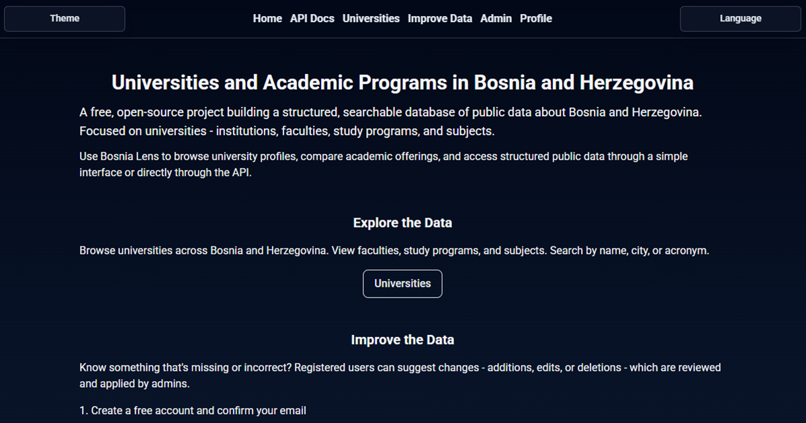

# UniAtlas Bosnia

An open-source platform for Bosnia and Herzegovina higher-education data, offering a REST API and React web app to explore universities, faculties, study programs, and subjects.

LIVE Web app - <https://uniatlas-bosnia.netlify.app/>

REST API - <https://round-leann-goran-jovic-1010-ccad2ae8.koyeb.app/api>

For more info on how to connect your app to the REST API, visit <https://uniatlas-bosnia.netlify.app/api-docs>



## Table of Contents

- [Features](#features)
- [Getting Started](#getting-started)
- [API Overview](#api-overview)
- [Running the Tests](#running-the-tests)
- [Deployment](#deployment)
- [Built With](#built-with)
- [Contributing](#contributing)
- [Authors](#authors)
- [License](#license)
- [Acknowledgments](#acknowledgments)

## Features

- **Versioned REST API**: Public endpoints under `/api/v1`
- **University Search**: Browse all universities or search by name, city, or acronym; retrieve full detail with faculties, study programs, and subjects
- **Study Program Search**: Search study programs by name across all universities
- **Session Authentication**: Passport-based auth with email/password signup, login, logout, and email confirmation
- **GitHub Login**: Optional OAuth2 authentication with GitHub
- **Suggestion-based Data Workflow**: Any authenticated user can suggest university data changes - admins review and approve or reject them
- **CSRF Protection**: Synchronised CSRF tokens required for all mutating requests to authenticated routes
- **First-party cookies**: Frontend proxies authenticated requests through Netlify (`/backend/*`) so session cookies are always same-site

## Getting Started

These instructions will get you a copy of the project up and running on your local machine for development and testing purposes. See deployment for notes on how to deploy the project on a live system.

### Prerequisites

Before running this project, you need to have the following installed:

- Node.js 24.x
- PostgreSQL database server
- npm package manager

```bash
node --version
npm --version
psql --version
```

You will also need:

- A Resend API key for email confirmations (<https://resend.com/>)
- GitHub OAuth credentials if you want GitHub login support (optional):
  - Visit <https://github.com/settings/developers> to create an OAuth app
  - Create a Client ID and Client Secret for your environment

### Installing

A step by step series of examples that tell you how to get a development environment running.

Clone the repository:

```bash
git clone https://github.com/goran1010/uniatlas-bosnia.git
cd uniatlas-bosnia
```

Install all dependencies for both backend and frontend:

```bash
npm run install:all
```

Set up environment variables:

The repository includes example environment files for both services. Copy them and fill in real values before running the app:

Backend: copy `backend/.env.example` to `backend/.env` and edit the values.

```bash
cp backend/.env.example backend/.env
# edit backend/.env
```

Backend env layout:

- `DATABASE_URL`: development PostgreSQL connection string
- `TEST_DATABASE_URL`: separate PostgreSQL database used by tests and test migrations
- `RESEND_API_KEY`: Resend API key for email confirmation
- `FRONTEND_URL`: frontend origin allowed by CORS, usually `http://localhost:5173`
- `BACKEND_URL`: backend's own publicly reachable URL, used for building email confirmation links, usually `http://localhost:3000`
- `PORT`: backend port, usually `3000`
- `COOKIE_SECRET`: session/cookie signing secret
- `NODE_ENV`: app mode, usually `development`
- `GITHUB_CLIENT_ID`: GitHub OAuth app client ID (optional, for GitHub login)
- `GITHUB_CLIENT_SECRET`: GitHub OAuth app client secret (optional, for GitHub login)
- `GITHUB_CALLBACK_URL`: GitHub OAuth callback URL - locally `http://localhost:3000/auth/github/callback`, in production `https://yoursite.netlify.app/backend/auth/github/callback`

Frontend: copy `frontend/.env.example` to `frontend/.env` and update `VITE_BACKEND_URL` if needed.

```bash
cp frontend/.env.example frontend/.env
# edit frontend/.env (optional)
```

Frontend env layout:

- `VITE_BACKEND_URL`: backend base URL, usually `http://localhost:3000` for local development. In production on Netlify, set this to `/backend` - the proxy rule in `netlify.toml` forwards those requests to the actual backend, keeping session cookies first-party.

Initialize the development database and generate the Prisma client:

```bash
npm run db:deploy_generate
```

Initialize the test database as well if you plan to run backend tests locally:

```bash
npm run db:test:deploy_generate
```

Seed the databases if needed:

```bash
npm run db:seed

# Seed test database
npm run db:test:seed
```

Start the development servers:

```bash
# Run frontend and backend together
npm run dev:all

# Or run them separately
npm run dev:backend
npm run dev:frontend
```

You should now be able to access the API at `http://localhost:3000` and the web interface at `http://localhost:5173`.

## API Overview

### Response format

All JSON API responses follow a consistent structure:

- Success responses use `data` and include an optional `message`.
- Error responses use a nested `error.message`.

Success example:

```json
{
  "message": "Universities retrieved successfully",
  "data": [
    {
      "id": 1,
      "name": "University of Sarajevo",
      "acronym": "UNSA",
      "city": "Sarajevo",
      "entity": "FBIH",
      "ownership": "JAVNA"
    }
  ]
}
```

Error example:

```json
{
  "error": {
    "message": "Validation failed: Search term must have at least 2 characters."
  }
}
```

### Public endpoints (no authentication required)

All public endpoints are available under `https://round-leann-goran-jovic-1010-ccad2ae8.koyeb.app/api`

#### Status endpoints

- `GET /api` - Check API status
- `GET /api/v1` - Check API v1 status

#### University endpoints

- `GET /api/v1/universities` - Get all universities (ordered by name)
- `GET /api/v1/universities/search?searchTerm=...` - Search universities by name, city, or acronym (minimum 2 characters)
- `GET /api/v1/universities/:id` - Get a university by ID with full nested detail (faculties, study programs, subjects)

#### Study Program endpoints

- `GET /api/v1/study-programs/search?searchTerm=...` - Search study programs by name across all universities (minimum 2 characters)

**Search parameter:**

- `searchTerm` (required, string): A search string of at least 2 characters

**University object structure:**

```json
{
  "id": 1,
  "name": "University of Sarajevo",
  "acronym": "UNSA",
  "city": "Sarajevo",
  "entity": "FBIH" | "RS" | "BD",
  "ownership": "JAVNA" | "PRIVATNA",
  "foundedYear": 1949,
  "website": "https://www.unsa.ba",
  "faculties": [ ... ]
}
```

## Running the tests

Backend tests use Vitest and Supertest. Frontend tests use Vitest, React Testing Library, and JSDOM.

### Run all tests

```bash
npm run test:all
```

### Run individual test suites

```bash
npm run test:backend
npm run test:frontend
```

### Run coverage

```bash
npm run test:coverage:all
npm run test:coverage:backend
npm run test:coverage:frontend
```

The backend test suite expects `TEST_DATABASE_URL` to point to a separate PostgreSQL database.

## Deployment

The project is designed to be deployed with:

- **Backend**: Any Node.js hosting service capable of running Express and PostgreSQL-backed Prisma migrations. The backend `build` script runs `prisma generate` and `prisma migrate deploy` automatically.
- **Frontend**: Netlify (recommended). The `netlify.toml` proxy rule forwards `/backend/*` requests to the actual backend so session cookies remain first-party. Set `VITE_BACKEND_URL=/backend` in Netlify's environment variables.
- **Database**: PostgreSQL (Supabase, Koyeb, or self-hosted)

The public REST API (`/api/v1/...`) is served directly from the backend with open CORS and requires no authentication, so third-party apps can call the Koyeb URL directly without going through the Netlify proxy.

## Built With

### Backend

- [Express.js](https://expressjs.com/)
- [Prisma](https://www.prisma.io/)
- [PostgreSQL](https://www.postgresql.org/)
- [bcryptjs](https://www.npmjs.com/package/bcryptjs)
- [Express Validator](https://express-validator.github.io/)
- [Passport](https://www.passportjs.org/) & [Express Session](https://github.com/expressjs/session)
- [Helmet](https://helmetjs.github.io/)
- [Pino](https://getpino.io/)
- [Resend](https://resend.com/)
- [Vitest](https://vitest.dev/) & [Supertest](https://github.com/ladjs/supertest)

### Frontend

- [React](https://reactjs.org/)
- [Vite](https://vitejs.dev/)
- [React Router](https://reactrouter.com/)
- [TailwindCSS](https://tailwindcss.com/)
- [Vitest](https://vitest.dev/) & [React Testing Library](https://testing-library.com/react)

## Contributing

Please read [CONTRIBUTING.md](CONTRIBUTING.md) for details on our code of conduct, and the process for submitting pull requests. Contributions of data, code improvements, documentation, and bug reports are all welcomed.

## Authors

- **Goran Jović** - _Initial work_ - [@goran1010](https://github.com/goran1010)

See also the list of [contributors](https://github.com/goran1010/uniatlas-bosnia/contributors) who participated in this project.

## License

This project is licensed under the GNU Affero General Public License v3.0 (AGPL-3.0) - see the [LICENSE.md](LICENSE.md) file for details. All data used will be public domain or properly attributed to its original source.

## Acknowledgments

- General university data sourced from [Agencija za razvoj visokog obrazovanja i osiguranje kvaliteta Bosne i Hercegovine (HEA)](https://www.hea.gov.ba/Content/Read/lista-akreditiranih-vsu).
