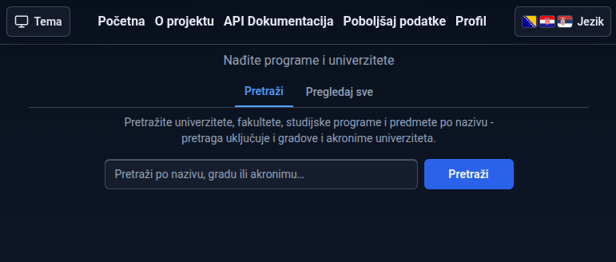

# UniAtlas Bosnia

An open-source monorepo for Bosnia and Herzegovina higher-education data. It combines a public REST API, an authenticated contribution workflow, and a React webapp for browsing universities and managing data suggestions.

Live webapp: <https://uniatlas-bosnia.netlify.app/>

Live server REST API: <https://round-leann-goran-jovic-1010-ccad2ae8.koyeb.app/api>

In-app API docs: <https://uniatlas-bosnia.netlify.app/api-docs>



## Table of contents

- [Project overview](#project-overview)
- [Current features](#current-features)
- [Getting started](#getting-started)
- [Environment variables](#environment-variables)
- [Database setup](#database-setup)
- [API overview](#api-overview)
- [Testing and quality checks](#testing-and-quality-checks)
- [Deployment notes](#deployment-notes)
- [Built with](#built-with)
- [Contributing](#contributing)
- [Authors](#authors)
- [License](#license)
- [Acknowledgments](#acknowledgments)

## Project overview

The project models higher-education data as a nested academic hierarchy:

- University
- Faculty
- Study program
- Track (smjer)
- Subject

Public consumers can browse and query that data through unauthenticated endpoints under `/api/v1`. Authenticated users can submit create, update, and delete suggestions for university-related data, and admins can review those suggestions before they are applied.

## Current features

- Public REST API under `/api` and `/api/v1`
- University listing with faculty counts, and detail responses containing nested faculties, study programs, tracks, and subjects
- Unified search across universities, faculties, study programs, tracks, and subjects — matching name, city, acronym, entity, ownership, study cycle, language, subject type, and parent unit names
- Email/password signup with email confirmation before account creation
- Session-based login/logout with Passport
- Optional GitHub OAuth login
- Authenticated contribution flow for university data suggestions
- Per-user pending-change listing and deletion
- Admin moderation endpoints for approving or declining pending changes
- CSRF protection for protected auth and user routes
- Zod request validation and webapp API-response validation
- Netlify proxy support for first-party session cookies in production

## Getting started

### Prerequisites

Install the following locally:

- Node.js 24.x
- npm
- PostgreSQL

Verify the toolchain:

```bash
node --version
npm --version
psql --version
```

You will also need:

- a Resend API key for signup confirmation emails
- GitHub OAuth credentials if you want GitHub login enabled

Create GitHub OAuth credentials at <https://github.com/settings/developers> if you plan to use the GitHub sign-in flow.

### Installation

Clone the repository:

```bash
git clone https://github.com/goran1010/uniatlas-bosnia.git
cd uniatlas-bosnia
```

Install root, server, and webapp dependencies:

```bash
npm run install:all
```

Create local environment files:

```bash
cp server/.env.example server/.env
cp webapp/.env.example webapp/.env
```

Then fill in the server values and adjust the webapp server URL if needed.

## Environment variables

### Server envs

The server example file lives at `server/.env.example`.

- `DATABASE_URL`: PostgreSQL connection string for development
- `TEST_DATABASE_URL`: separate PostgreSQL database for server tests
- `RESEND_API_KEY`: API key for confirmation emails
- `WEBAPP_URL`: webapp origin allowed by credentialed CORS
- `SERVER_URL`: public server base URL used in confirmation links
- `PORT`: server port, usually `3000`
- `COOKIE_SECRET`: session secret
- `NODE_ENV`: runtime mode, usually `development`
- `GITHUB_CLIENT_ID`: optional GitHub OAuth client ID
- `GITHUB_CLIENT_SECRET`: optional GitHub OAuth client secret
- `GITHUB_CALLBACK_URL`: GitHub OAuth callback URL

Local callback example:

```text
http://localhost:3000/auth/github/callback
```

Production callback example with the Netlify proxy:

```text
https://yoursite.netlify.app/server/auth/github/callback
```

### Webapp envs

The webapp example file lives at `webapp/.env.example`.

- `VITE_SERVER_URL`: server base URL used by the React app

Typical local value:

```text
http://localhost:3000
```

Typical Netlify production value:

```text
/server
```

## Database setup

Run development migrations and generate the Prisma client:

```bash
npm run db:deploy_generate
```

Seed the database if needed:

```bash
npm run db:seed
```

Start both services:

```bash
npm run dev:all
```

Or start them separately:

```bash
npm run dev:server
npm run dev:webapp
```

Local defaults:

- server: `http://localhost:3000`
- webapp: `http://localhost:5173`

## API overview

### Response shape

Successful responses return `data` and usually a `message`.

```json
{
  "message": "Universities retrieved successfully.",
  "data": [
    {
      "id": 1,
      "name": "University of Sarajevo",
      "acronym": "UNSA",
      "city": "Sarajevo",
      "entity": "FBIH",
      "ownership": "JAVNA",
      "foundedYear": "1949",
      "website": "https://unsa.ba",
      "_count": { "faculties": 23 }
    }
  ]
}
```

Errors return an `error.message` payload.

```json
{
  "error": {
    "message": "Validation failed: Search term must have at least 2 characters."
  }
}
```

### Public endpoints

Base URL:

```text
https://round-leann-goran-jovic-1010-ccad2ae8.koyeb.app
```

- `GET /api`
- `GET /api/v1`
- `GET /api/v1/universities`
- `GET /api/v1/universities/:id`
- `GET /api/v1/search?searchTerm=`

### Contribution workflow

Contribution requests are stored as pending changes. Each record captures:

- the entity type: `UNIVERSITY`, `FACULTY`, `STUDY_PROGRAM`, `TRACK`, or `SUBJECT`
- the change type: `CREATE`, `UPDATE`, or `DELETE`
- a target ID or parent ID when required
- the proposed JSON payload for admin review

Successful email confirmation currently ends with a rendered confirmation page, while session-based login and logout return JSON responses.

## Testing and quality checks

### Tests

Run all tests:

```bash
npm run test:all
```

Run service-specific suites:

```bash
npm run test:server
npm run test:webapp
```

Run coverage:

```bash
npm run test:coverage:all
npm run test:coverage:server
npm run test:coverage:webapp
```

Server tests require `TEST_DATABASE_URL` to point to a separate PostgreSQL database. The test setup creates and manages its own template database automatically.

### Quality checks

```bash
npm run lint:all
npm run typecheck:all
npm run format:check:all
```

## Deployment notes

- Server: any Node.js host that can run Prisma migrations against PostgreSQL
- Webapp: Netlify, using `webapp/netlify.toml` to proxy `/server/*` to the server
- Cookies: the proxy keeps auth requests first-party in production
- Public API consumers can call the server directly without the Netlify proxy

## Built with

### Server

- Express
- Prisma
- PostgreSQL
- Zod
- PassportJS
- express-session
- csrf-sync
- Helmet
- Pino
- Resend
- Vitest
- Supertest

### Webapp

- React
- Vite
- React Router
- Tailwind CSS
- React Helmet Async
- Vitest
- React Testing Library

## Contributing

See [CONTRIBUTING.md](./CONTRIBUTING.md) for contribution guidelines. Code changes, documentation updates, bug reports, and data-quality improvements are all welcome.

## Authors

- Goran Jović - [@goran1010](https://github.com/goran1010)

See also the list of [contributors](https://github.com/goran1010/uniatlas-bosnia/contributors).

## License

This project is licensed under the GNU Affero General Public License v3.0. See [LICENSE.md](./LICENSE.md).

## Acknowledgments

- General university data sourced from [Agencija za razvoj visokog obrazovanja i osiguranje kvaliteta Bosne i Hercegovine (HEA)](https://www.hea.gov.ba/Content/Read/lista-akreditiranih-vsu)
